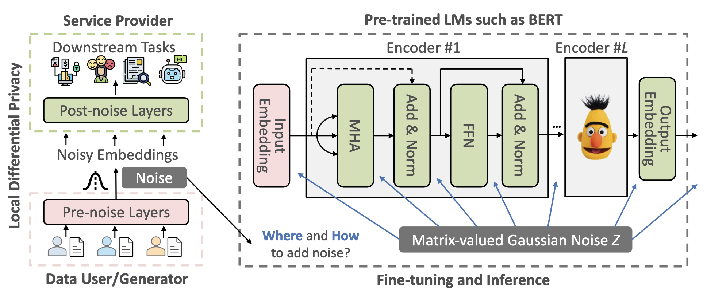

# DP-Forward

Code for the CCS'23 submission 
"DP-Forward: Fine-tuning and Inference on Language Models with Differential Privacy in Forward Pass"

Note that this repo is anonymous and only intended for **review** purpose only. 

## Introduction

We show how to achieve metric-based local DP (LDP) by sanitizing *sentence embedding (and labels)*
(as opposed to *gradients* in DP-SGD) when fine-tuning pre-trained language models like BERT.

<p align="center">

</p>

## Setup Environment

### Install required packages

```shell
pip install -r requirements.txt
```

## Fine-tune BERT model with DP-Forward

```bash
python run_glue.py \
--model_name_or_path bert-base-uncased \
--task_name sst2
--do_train
--do_eval
--max_seq_length 64
--per_device_train_batch_size 32
--per_device_eval_batch_size 64
--learning_rate 2e-5
--num_train_epochs 3
--output_dir tmp/SST2_epoch3_lr2e-5_bs32_normc1.0_eps1_8_eps2_2.2_noise_layer_10_proj_dim_256
--overwrite_output_dir
--logging_steps 100
--save_steps 8000
--epsilon 8.0
--epsilon2 2.2
--noise_position encoder
--norm_c 1.0
--noise_layer 10
--encoder_sub_noise_position add_and_norm_2
--add_noise_inference True
--proj_dim -1
--local_dp False
--label_dp
```

## Membership Inference Attacks

```bash
python attack/membership_inference_attack.py \
--model_name_or_path tmp/SST2_epoch3_lr2e-5_bs32_normc1.0_eps1_8_eps2_2.2_noise_layer_10_proj_dim_256 \
--task_name sst2 \
--max_seq_length 128 \
--per_device_eval_batch_size 64 \
--overwrite_cache
```

## Sensitive Attribution Attack

```bash
python attack/sensitive_attributes_attack.py --model_name_or_path tmp/SST2_epoch3_lr2e-5_bs32_normc1.0_eps1_8_eps2_2.2_noise_layer_10_proj_dim_256
```

## Embedding Inversion Attack

```bash
python attack/sensitive_attributes_attack.py --model_name_or_path tmp/SST2_epoch3_lr2e-5_bs32_normc1.0_eps1_8_eps2_2.2_noise_layer_10_proj_dim_256
```